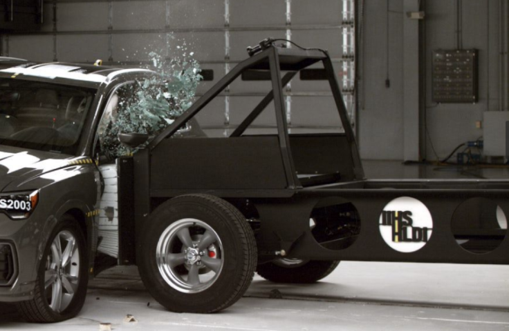

# Side testing

This repository contains supporting documentation for the IIHS side impact crash test program.

## [2.0](2.0/README.md) - October 2020

In late 2020, the Institute began side impact testing using a new "2.0" protocol, which
features an improved impact cart and an impact speed of 60 km/h. This directory contains documentation
regarding the new protocol and manufacturing specs for the new impact cart.

## [1.0](1.0/README.md) - 2003 to 2020

This directory contains documentation regarding the Institute's original side impact crash test
program, in place since its inception in 2003.
